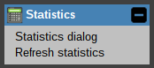
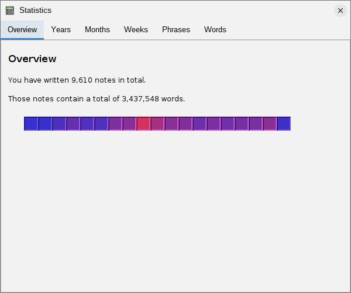
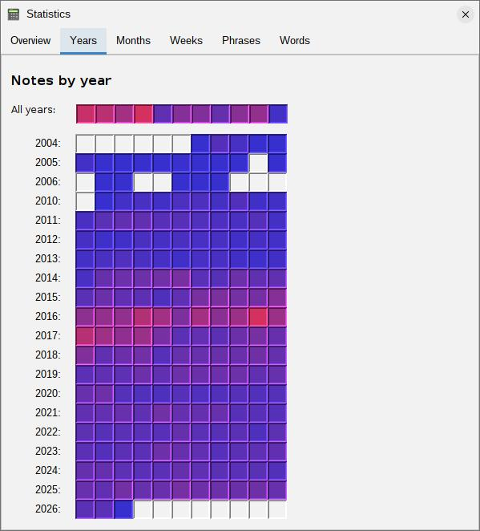
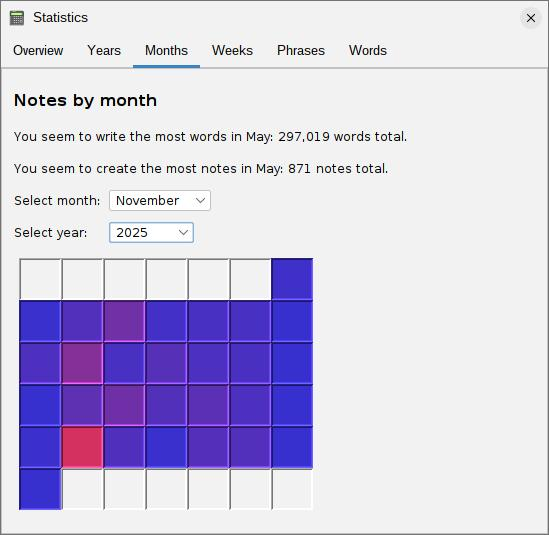
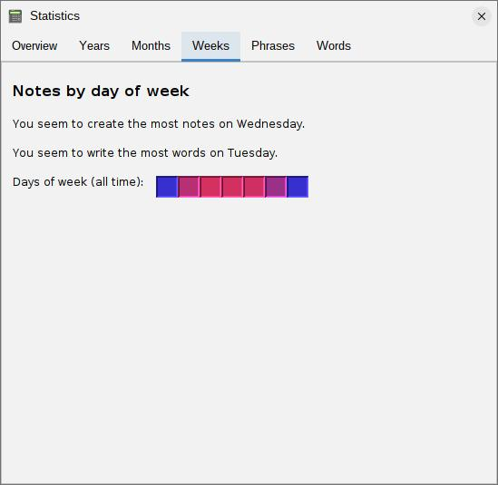
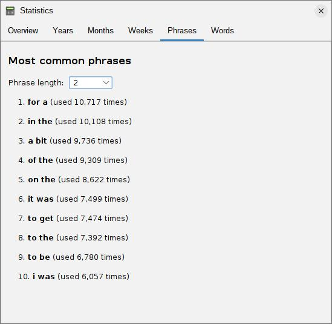
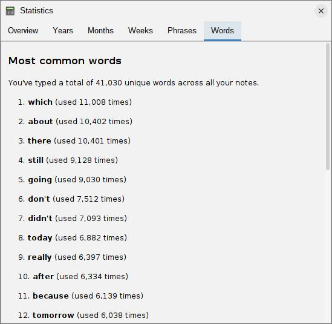
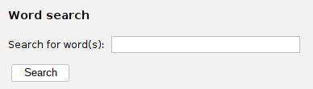
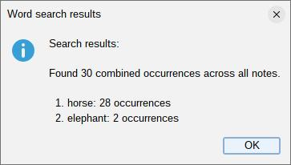
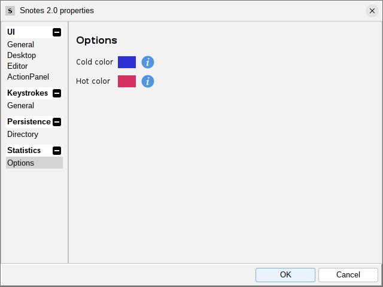

# ext-sn-statistics

## What is this?

This is an extension for the [Snotes](https://github.com/scorbo2/snotes/) application to offer statistics
across all of your notes. When installed, a new "Statistics" action group will appear in the left action panel,
with options for launching the statistics dialog, or for manually loading/refreshing statistics. It looks like this:



Selecting the "Statistics dialog" option will load all statistics automatically. This process might take some
time, depending on the size of your note collection! Once the progress dialog completes, the statistics
dialog will appear, offering different types of statistics.

### Tab 1: Statistics Overview



Here we see a count of how many notes you've written, and the total combined word count across all notes.
Additionally, a heatmap chart is shown, with one cell for each unique year in which you have created notes.
The color of each cell ranges from a cold blue (for years with few notes) to a hot red (for years with many notes).
This gives you a quick visual overview of when you were most productive. The color range is configurable!
See the "configuration options" section below. Hovering over any cell in the heatmap will show a tooltip
with the exact count of notes, and count of words, for that year.

Note that if you have fewer than four unique years of notes, the heatmap chart will be replaced with a
simple label-based display, with one line of text summarizing each year.

### Tab 2: Notes by year



Here we see two heatmaps. The first is an "all years" summary with 12 cells, laid out horizontally.
Each cell in this heatmap represents the combined total of all notes created in that month, across all years.
The same blue-to-red color scheme is used in this heatmap (and, in fact, in all heatmaps in this dialog).

The second heatmap is a "year-by-year" breakdown, with one row for each unique year in which you created notes.
In the example pictured above, note that some cells are not colored - this means that no notes were created
in that month of that year. Note also that the list of years may have gaps in it, if no notes at all were
created in a given year. The color scale in this second heatmap is computed based on data from across years.
This allows you to meaningfully compare months in different years. In the example above, you can easily see
that 2016 and 2017 were much more productive years than 2012 and 2013.

Once again, you can hover over any cell in the heatmap to see a tooltip with the exact count of notes and
words for that month and year.

### Tab 3: Notes by month



On this tab, you will see your most active month on record, both by word count and also by note count, across all years.
In the example above, these are the same month (May), but they might be different, depending on how you take notes!

You are also presented with choosers for selecting a specific month and year. Both choosers have an "All" option,
which will show a combined total across all months and all years. Selecting a specific month and year
will show a heatmap in calendar format, with one cell for each day of that month.

Note that unlike ISO-8601, the calendar heatmap displayed here starts with Sunday as the first day of the
week, and ends with Saturday as the last day of the week, following the North American standard.

### Tab 4: Notes by day of week



On this tab, you will see your most active day of the week on record, both by word count and also by note count,
across all years. In the example above, note that Wednesday holds the record for "most notes created", but
Tuesday holds the record for "most words written". Also note that the weekdays are red, while the weekends
are blue. Clearly, this user is more productive during the week than on the weekend! Hover over the cells
to see the exact counts for each day of the week.

### Tab 5: Most common phrases



Here we see the reason the progress dialog took so long to complete when we first brought up the dialog.
Scanning for most common phrases is computationally expensive, especially if you have a large note collection!
Here you are presented with a phrase length chooser. We see in the example above that the default value
is "2", meaning that we are looking at the most common two-word phrases across all notes. Perhaps unsurprisingly,
this does not yield terribly interesting results - we see the most frequent two-word phrase above is "for a".
But, the phrase length chooser allows you to look for phrases up to 10 words in length, which will certainly
yield more interesting results.

### Tab 6: Most common words



Here, you will see a count of the total unique words you've written across all notes. But wait, didn't we
see that on tab 1? Not quite! On tab 1, we see the total word count across all notes. Here, we see the total
*unique* word count, with duplicates removed. The example above shows `41,030` unique words, which is a pretty
good vocabulary!

Next, you are presented with a list of up to 25 of the most commonly-used words across all notes, along with
their counts. Note that short words (currently defined as four or fewer characters) are NOT included, as they
are generally not very interesting. (Words like "a", "an", "but", "then", and so on). Even with these exclusions,
we note that the words in the above example are fairly common, and not very interesting. But keep scrolling down!



Here we see a small search form that you can use to search for specific word(s) in your note collection.
Let's search for "elephant, horse, rhino" (multiple words can be entered, separated by spaces or commas).
The result looks like this:



We see that "horse" appeared 28 times, and "elephant" appeared twice. We don't see "rhino" in the results
dialog, which means that this word never appeared in any of our notes. This is a fun way to see how many
times you've used a particular word (or set of words) across all of your notes!

Searching for specific multi-word phrases is not currently supported.
You can only search for individual words on this tab.
A future version may address this.

## Caching statistics

The long delay that we saw when first bringing up the statistics dialog only happens once! After a successful
load, the results are cached in memory. So, selecting the "Statistics dialog" option again will bring up the dialog
immediately, without any delay. If you've added, modified, or deleted notes, and wish to see the results,
you can select the "Refresh statistics" option. The cache is cleared, and fresh statistics are gathered.
Once you receive the confirmation message, you can select the "Statistics dialog" option again to see the updated
results.

## Configuration options

You can configure the color scheme used in the heatmaps by going to "Preferences" in the left action panel, and then
visiting the "Statistics" tab:



If you don't like the default blue-to-red color scheme, you can choose whatever range you like!
Select your colors, and click "OK". The new colors will be applied on your next visit to the statistics dialog.
The same color scheme is applied to all heatmaps in the dialog, so you only need to set it once.

## How do I get it?

Start by installing the [Snotes](https://github.com/scorbo2/snotes/) application, if you haven't already.
Then, you can install this extension directly from within the application.

The easiest way to install the extension is to select the "Extension Manager" action from the "Options" group in the
left action panel. Visit the "available" tab, and find "Statistics" in the list on the left. An "Install" button will
appear in the top right. Click it, and the extension will be downloaded and installed. You will be prompted to
restart the application, and once you do, the new "Statistics" action group will be available in the left action panel.

To uninstall the extension later, go back to the Extension Manager dialog, and find "Statistics" on the "Installed"
tab. An "Uninstall" button will appear in the top right. Click it, and the extension will be uninstalled. You will be
prompted to restart the application, and once you do, the "Statistics" action group will be removed from the
left action panel.

### Alternatively: build from source and install manually

If you have Java 17 and Maven installed, you can build this extension from source, and install the jar manually.

```shell
git clone https://github.com/scorbo2/ext-sn-statistics.git
cd ext-sn-statistics

# This builds the jar file:
mvn clean package

# Now we can copy it into place manually.
# The default location is ".Snotes/extensions" in your home directory:
rm ~/.Snotes/extensions/ext-sn-statistics-*.jar # optionally remove any older version of the jar first
cp target/ext-sn-statistics-*.jar ~/.Snotes/extensions
```

Now, restart Snotes (if it was running), and the jar will be picked up automatically on next launch!

To uninstall the extension, just delete the jar file from the extensions directory, and restart Snotes.

## Bug reports and feature requests

- You can find the project page on GitHub: [ext-sn-statistics](https://github.com/scorbo2/ext-sn-statistics)
- Use the [issues page](https://github.com/scorbo2/ext-sn-statistics/issues) to report bugs or request features. Please
  search first to see if your issue/feature request has already been reported, and if not, feel free to open a new
  issue!

## License

The Snotes application and this extension are licensed under the [MIT License](LICENSE).
